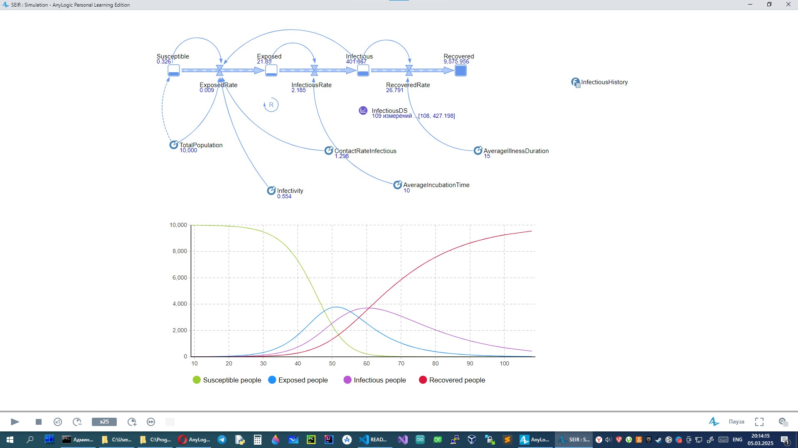
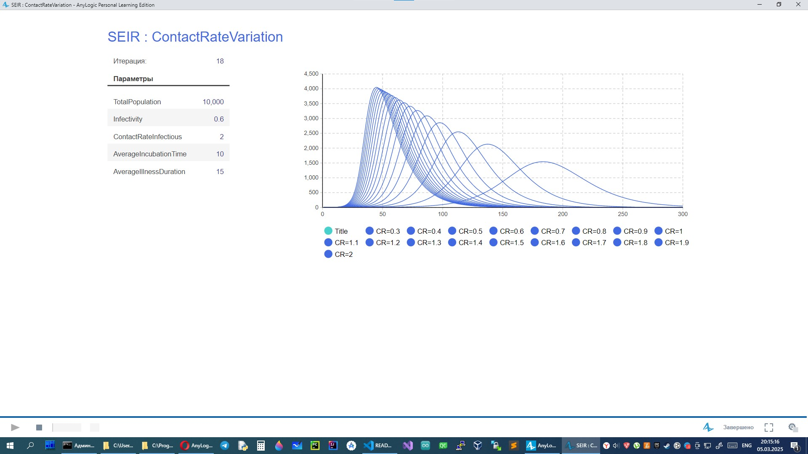
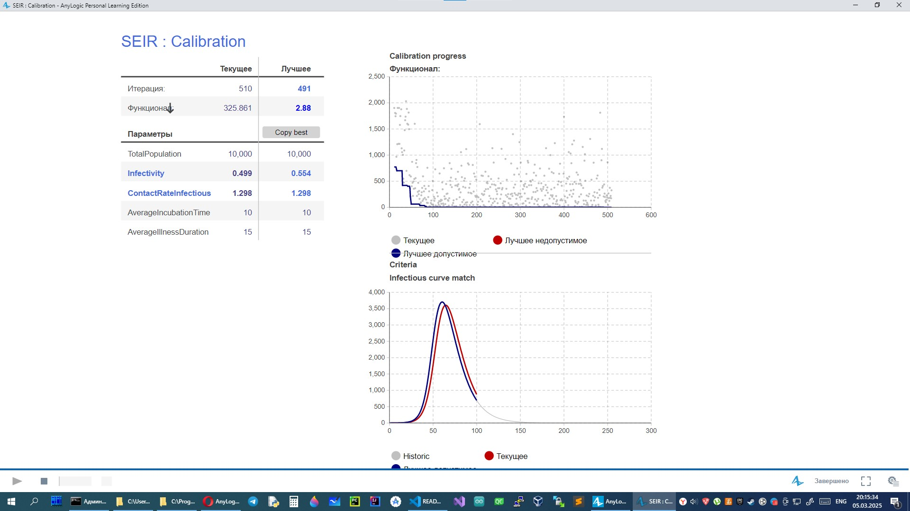

# AnyLogic

## Модель потребительского рынка

<table>
    <tr>
        <td></td>
        <td></td>
    </tr>
</table>

## Модель распространения эпидемии

<table>
    <tr>
        <td></td>
    </tr>
    <tr>
        <td></td>
    </tr>
    <tr>
        <td></td>
    </tr>
</table>